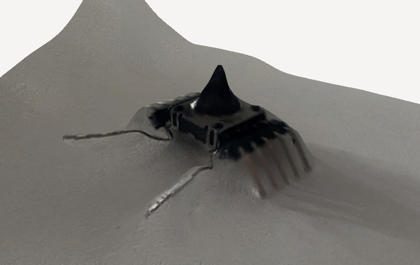

## Bought some eletronics at the market.
## Made a smaller shrimp, looks good.

## Scan test to see scale possibility

## What now ?
- Scan should be possible on small objects.
- we still have to put legs on the small shrimp. 
- Continue the bigger one.
- Don't forget to bring old stuff from home as well !