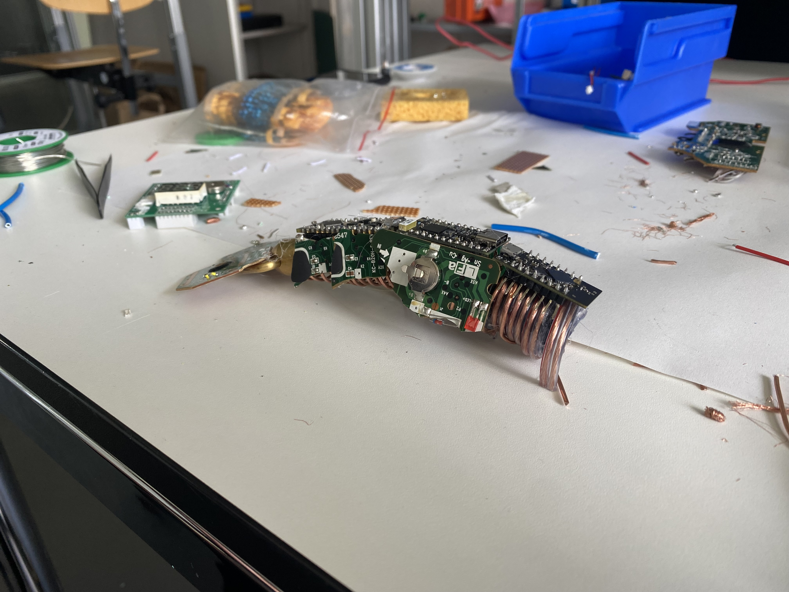
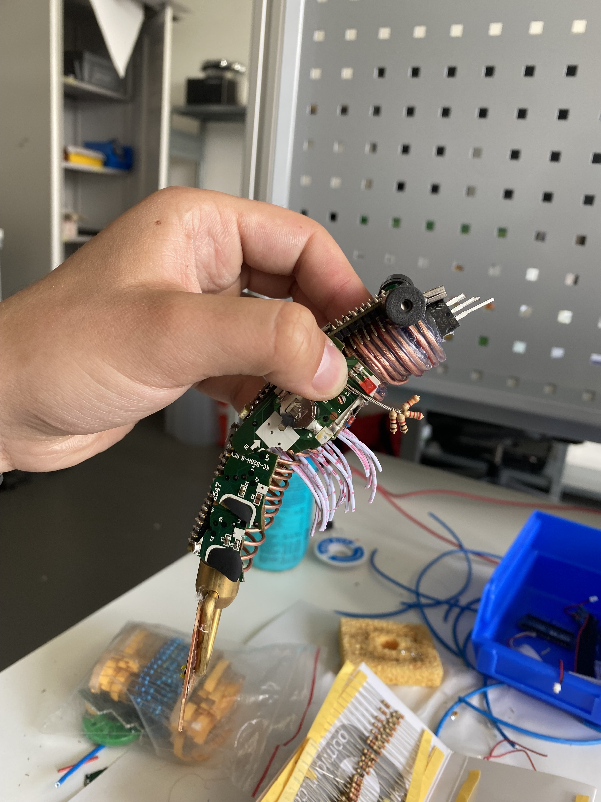
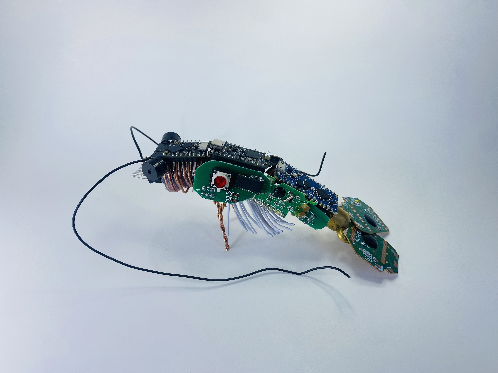
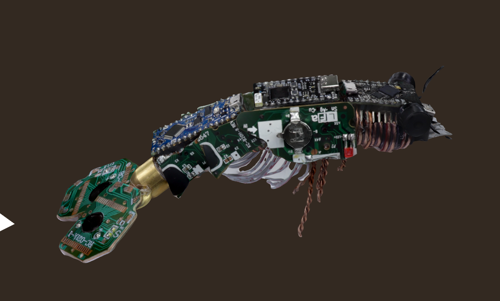
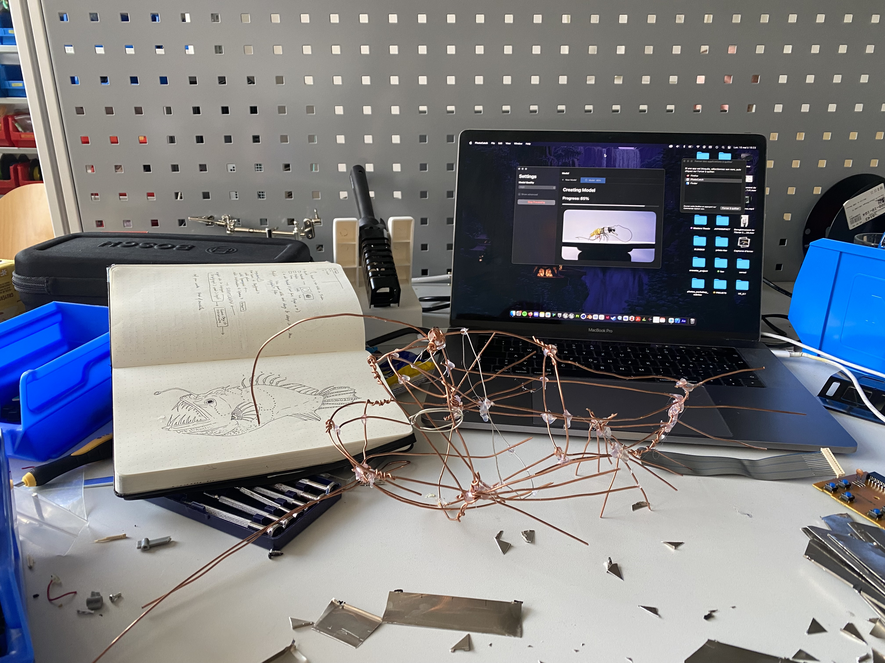
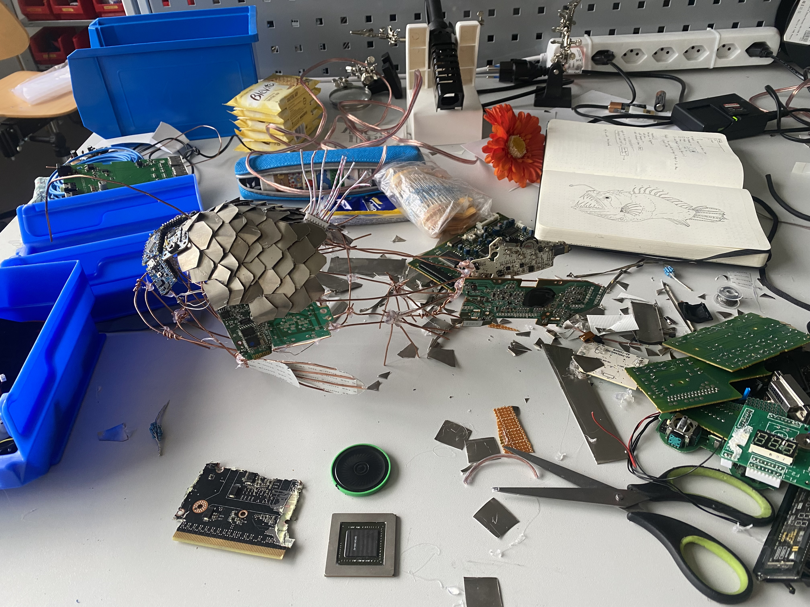
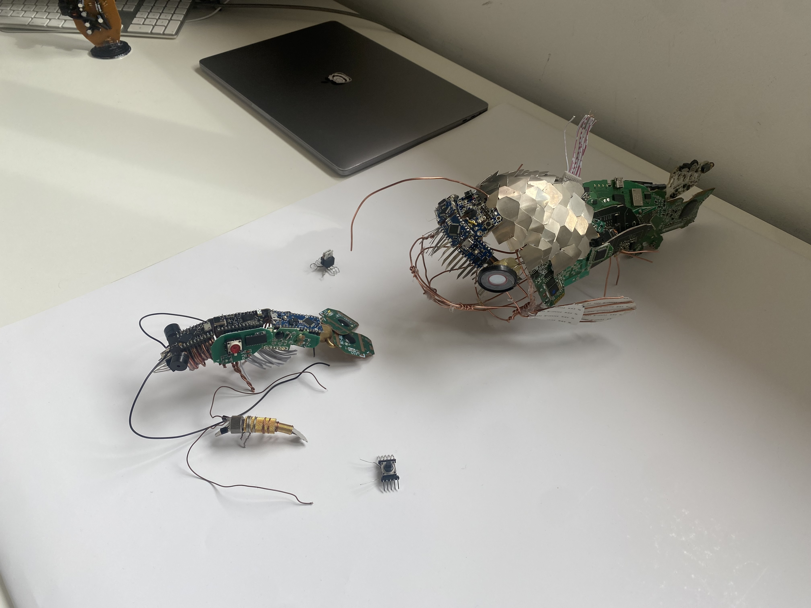
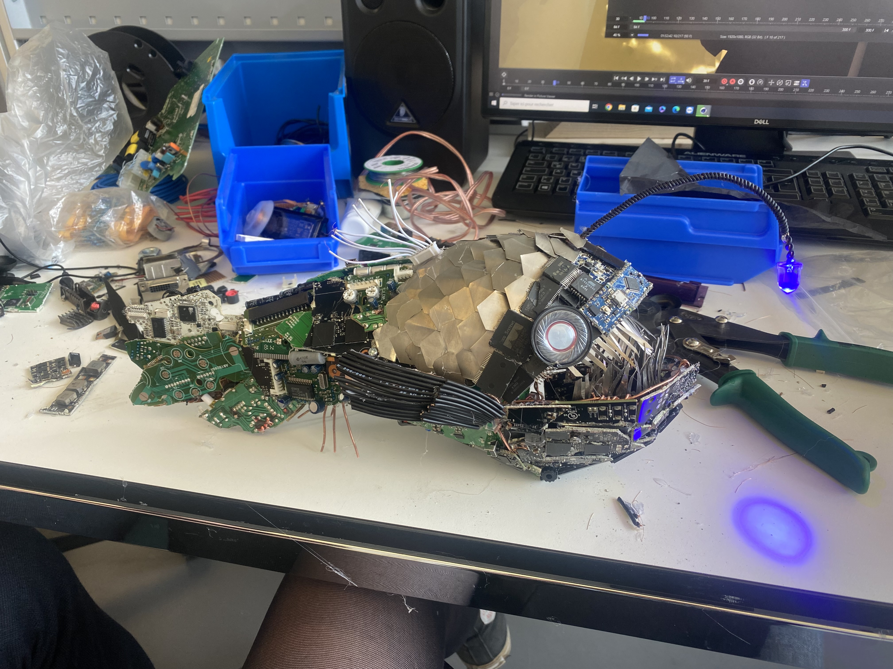

## Since 2 weeks....
-  We collected discarded electronics 
- Finished the big shrimp
- Created the predator...The big angry/hungry fish

## Some photos of the process

## Shrimp Process

## Almost done

## Final Shrimp

## Scan Shrimp

## Big fish process
  

## Begin to add the electronics
  

## Small presentation output
Fish is not done yet

## Angry fish is finished
Fish is not done yet
  